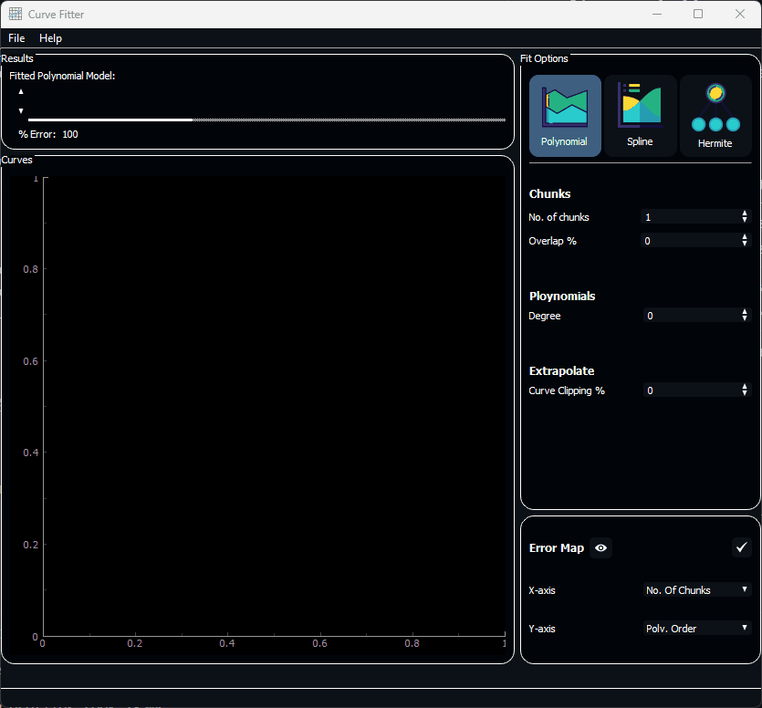

# Curve Fitter

An application that illustrates the efficacy of multiple curve fitting and interpolation models.

## Features

| Feature | Description |
|---------|-------------|
|**Interpolation**|Interpolation of data points using chunks, spline and hermite cubic methods of polynomial interpolation|
|**Extrapolation**|Extrapolation of data points using polynomial extrapolation of coefficients|
|**Error Map**|Error map of data points based on selected interpolation model|

## Preview



## Installation

```pip install requirements.txt```

## Team Members

| Names             |
| ----------------- |
| Mohamed Nasser    |
| Zeyad Mansour     |
| Mariam Hanafy     |
| Abdullah Saeed      |
